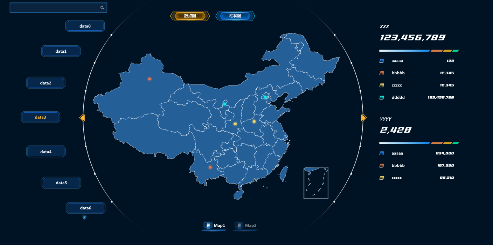

# react-echart-map
基于react和echart地图，实现的数据展示大屏幕

## 项目亮点
- 左侧菜单是用原生js实现的圆弧滚动菜单
- 中间部分是 echart map 地图，分别是散点图，柱状图，发散效果图
- 右边部分是统计，数字采用动态增长效果

## 大屏展示效果图，如果加上背景图片，效果会更好

## 启动步骤
1. 先按照依赖 npm install
2. 在终端运行命令 npm run start

